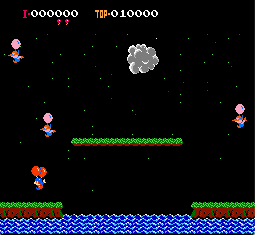
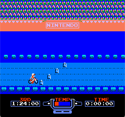
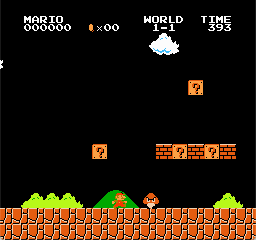

# Nerl
## A NES emulator written in Golang

### Screenshots

### Usage
`./nerl r.rom`

### Controls
* A = A
* B = S
* Z = Start
* X = Select
* Up, Down, Left, Right = arrow keys

### Dependencies
* SDL2
* Go >= 1.13

### Tested games
* Excitebike
* Super Mario Bros
* Balloon Fight

### Limitations
* Emulates only NROM mapper games
* No sound
